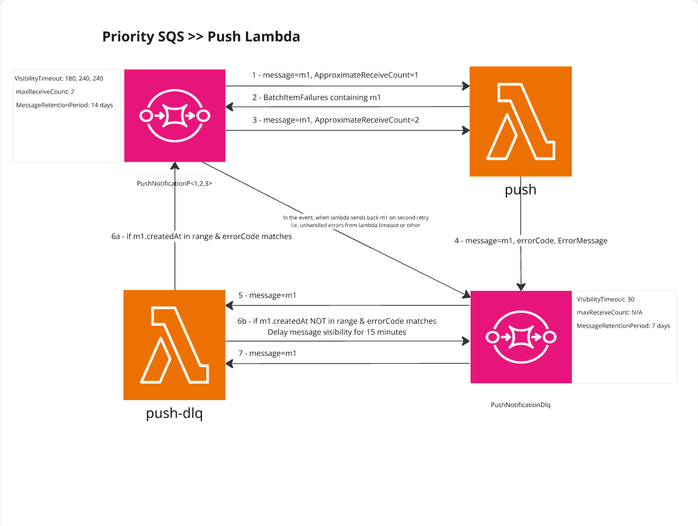

# Quick Intro

High‑level summary of the push DLQ flow; the full operational guide begins at “Push Dead Letter Queue (DLQ) – Operations & Reprocessing Guide” below.

### When does a push message fail?
Typical causes:
* Notification not found in DynamoDB
* One or more device publish attempts fail
* Infrastructure / dependency issues (DynamoDB query errors, SNS / SQS send failures)

### Retry & DLQ path (high level)
1. First failure: the message is retried once by SQS (Lambda returns a batch item failure).
2. Second failure: the `push` Lambda wraps the original command in a `FailedPushCommand` (adds `errorCode` / `errorMessage`) and sends it to the DLQ.

### DLQ message contents
* From `push` Lambda (second failure): includes `errorCode` + `errorMessage`.
* From other sources (rare redrive/manual): may lack error metadata.

### Reprocessing criteria (simplified)
The DLQ handler (`push-dlq` Lambda) only re-queues a failed message when the error code is allowed (explicit list or wildcard `*`) AND `createdAt` is inside the configured start/end window; otherwise it parks the message back in the DLQ with a 15‑minute delay to avoid tight reprocessing loops.

Refer to the comprehensive sections below for runbook, environment variables, and operational guidelines.
# Push Dead Letter Queue (DLQ) – Operations & Reprocessing Guide

This document describes how failed push (and scheduled push) commands transition to the Dead Letter Queue and how the `push-dlq` Lambda selectively reprocesses them.

## 1. Normal Push Processing Flow

The `push` Lambda consumes SQS messages containing a `PushCommand` (`action: 'push' | 'schedule'`). For each message:

1. It looks up the notification in DynamoDB.
2. It resolves eligible devices (APNS / GCM / GCM_BETA) and attempts to publish via SNS.
3. It records successful `pushEvents` and marks the notification `pushStatus = done` when all devices are processed.
4. Failures are handled with a two‑stage retry strategy:
   - First failure (ApproximateReceiveCount = 1): Lambda returns a `batchItemFailure` so SQS will retry the whole message.
   - Second failure (ApproximateReceiveCount > 1): Lambda sends a `FailedPushCommand` to the DLQ (includes `errorCode` + `errorMessage`).

Failures include (non‑exhaustive):
* Notification not found.
* Device publish errors (SNS publish failure, unsupported push service).
* Infrastructure / dependency errors (Dynamo query, SNS, SQS send).

SNS endpoint disabled exceptions are treated as non‑retryable: the device is disabled asynchronously and not counted as a hard failure for the message.

## 2. DLQ Message Format

Messages arriving in the DLQ fall into two categories:

| Origin | Body Contains | Notes |
|--------|---------------|-------|
| `push` Lambda (second failure) | `FailedPushCommand` (original command fields + `errorCode`, `errorMessage`) | Provides precise error classification. |
| Direct queue redrive / manual injection (rare) | Original command without error metadata | Reprocessing logic may treat these as ineligible unless `processAllErrors` is used. |

`FailedPushCommand` shape (simplified):

```
{
  action: 'push' | 'schedule',
  // original command fields ...,
  errorCode: <number>,
  errorMessage: <string>
}
```

## 3. `push-dlq` Lambda Purpose

The `push-dlq` Lambda replays only a **targeted slice** of failed commands to prevent uncontrolled floods after systemic issues (e.g. SNS rate limiting). Ineligible messages are parked back into the DLQ with a delay to avoid hot looping.

### Environment Variables (Inputs)

| Variable | Description | Example |
|----------|-------------|---------|
| `PUSH_DLQ_QUEUE_URL` | DLQ URL (for parking ineligible messages) |  |
| `PUSH_QUEUE_BASE_URL` | Base URL for priority queues; final target = `${base}P<priority>` |  |
| `PROCESS_START_AT` | Inclusive lower bound (epoch ms) for `createdAt` eligibility; ISO-8601 in env transformed to epoch | 2025-11-14T08:30:00Z |
| `PROCESS_END_AT` | Inclusive upper bound (epoch ms) | 2025-11-14T09:00:00Z |
| `PROCESS_ERROR_CODES` | Comma separated numeric codes OR `*` for all | `1004,2003` or `*` |

`PROCESS_ERROR_CODES='*'` sets `processAllErrors=true`.

### Eligibility Logic
Eligibility: a failed message is re-queued to its priority priority queue only when its error code is allowed (explicitly listed or all enabled via `*`) AND its `createdAt` timestamp lies within the inclusive start/end window; otherwise it is returned to the DLQ with a 15‑minute delay to avoid hot looping.

Requeue target queue URL: `${PUSH_QUEUE_BASE_URL}P${priority}` where `priority` is taken from the original command / notification.

Non‑eligible messages are re‑submitted to `PUSH_DLQ_QUEUE_URL` with `DelaySeconds = 900` (15 minutes) to throttle repeated scans.

## 4. Reprocessing Runbook (Example: SNS Throughput Exceeded)

Scenario: During a high‑volume campaign, `push` hits the SNS mobile push publish quota causing intermittent `PublishFailed` errors. Some messages succeed on retry; others are DLQ'd with errorCode `1004` (PushFailed).

Recommended steps:

1. Assess concurrency: verify current reserved concurrency / parallelism. Excess concurrency may amplify quota saturation; reduce if necessary.
2. Identify impact window: determine first and last approximate `createdAt` of affected notifications (from DLQ sample or logs).
3. Sample DLQ messages: confirm dominant `errorCode` (e.g. `1004`).
4. Set env vars on `push-dlq` Lambda:
   * `PROCESS_START_AT` / `PROCESS_END_AT` to the bounded window.
   * `PROCESS_ERROR_CODES=1004` (or a list). Avoid `*` unless tightly time‑bounded.
5. Enable the event source mapping (if disabled) to start processing.
6. Observe:
   * DLQ depth should decrease.
   * Priority queue depth will temporarily rise then drain as `push` processes replays.
   * Metrics: watch `notification-pushed`, `push-failed`, and DLQ log entries.
7. If failures persist (still quota constrained), disable mapping, reconsider concurrency then repeat with an adjusted window.
8. Once stable (error rate normal, messages replayed), disable the mapping to prevent accidental reprocessing later.

## 5. Safety & Operational Guidelines

* Always use a **narrow time window**; broad windows + `*` can resurrect very old (last 7 days) failures unintentionally.
* Prefer specific error codes over wildcard to reduce noise.
* Keep an eye on downstream system while replaying to avoid cascading new failures.
* Repeated ineligible messages will cycle every 15 minutes; adjust window or finalize resolution to prevent indefinite loops.

## 6. Error Codes Reference (PushErrorCode)

| Code | Name | Description |
|------|------|-------------|
| 1001 | PublishFailed | SNS publish attempt to a device endpoint failed. |
| 1004 | PushFailed | Aggregate push failure for a notification (one or more device publishes failed). |
| 2001 | ProcessRecordFailed | Generic fallback when a record fails without a specific classification. |
| 2002 | PushServiceNotSupported | pushService was not APNS / GCM / GCM_BETA. |
| 2003 | NotificationNotFound | Notification not found in DynamoDB for provided key. |
| 3001 | SqsSendFailed | SQS infrastructure/dependency failure when sending a secondary message. |
| 9000 | Unknown | Unknown / uncategorized fallback error. |

Notes:
* `EndpointDisabledException` is not mapped to an error code for DLQ; device is disabled instead of failing the whole record.
* A scheduled push failing device delivery will surface under the same device-level codes.

## 7. Quick Checklist (Before Reprocessing)

1. Time window confirmed? ✅
2. Error codes enumerated? ✅
3. Concurrency acceptable / tuned? ✅
4. Mapping disabled until vars set? ✅
5. Monitoring dashboards / logs prepared? ✅


## 8. Edge Cases

| Case | Handling |
|------|----------|
| Notification updated after initial schedule | Scheduled replay still uses original command; may need manual vetting if versions diverged. |
| Old messages outside window | Parked repeatedly with 15‑min delay until window adjusted or message manually purged. |
| Mixed error codes in same window | Include all needed codes explicitly; avoid `*` if only subset is actionable. |


## 9. Example Env Configuration

```
PROCESS_START_AT=2025-11-14T08:30:00Z
PROCESS_END_AT=2025-11-14T09:00:00Z
PROCESS_ERROR_CODES=1004,2003
```

## 10. Summary

The DLQ pathway ensures reliability: a single retry for transient issues, then structured quarantine with selective, time‑boxed replay. Proper use of the `push-dlq` Lambda prevents both message loss and uncontrolled flood retries.

---
If improvements (new error codes or strategy changes) are implemented, update this document rather than creating ad‑hoc summaries.
